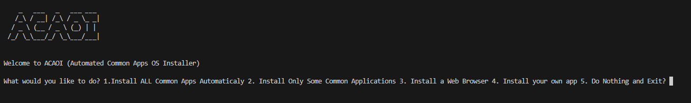

# ACAOI💻
Automated Common Apps OS Installer



# What is it?

ACAOI is a tool for many operating systems to install a common set of applications, such as Firefox, VS Code, Spotify, Steam, LibreOffice, and VLC. This program allows you to either (depending on the OS):

- Install a custom package (macOS, Windows, Linux)
- Install a set of common packages (Windows, Linux)
- Install a set of browsers (Windows, Linux)
- Install a set of more apps (Windows)

You can read the lists in the repo if you want (although they are the Windows Versions.)
Source code is avaliable under main.py.

# Running
```sh
git clone https://github.com/dumbdev343/acaoi
cd acaoi
python main.py
# or python3 main.py
```
